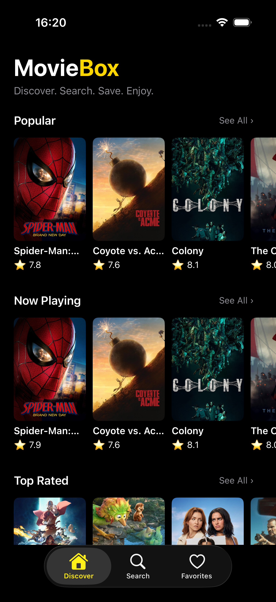
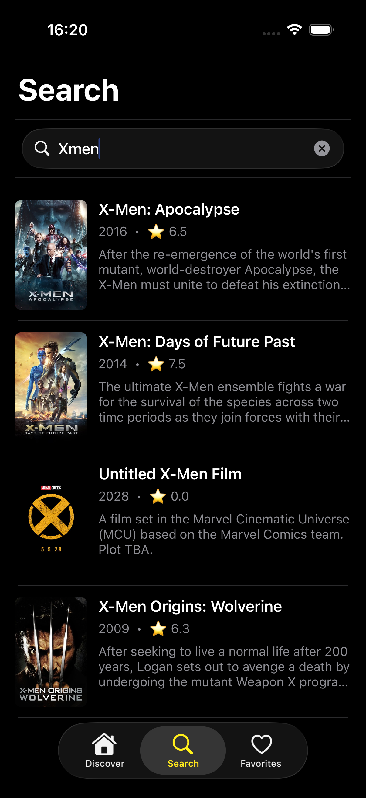
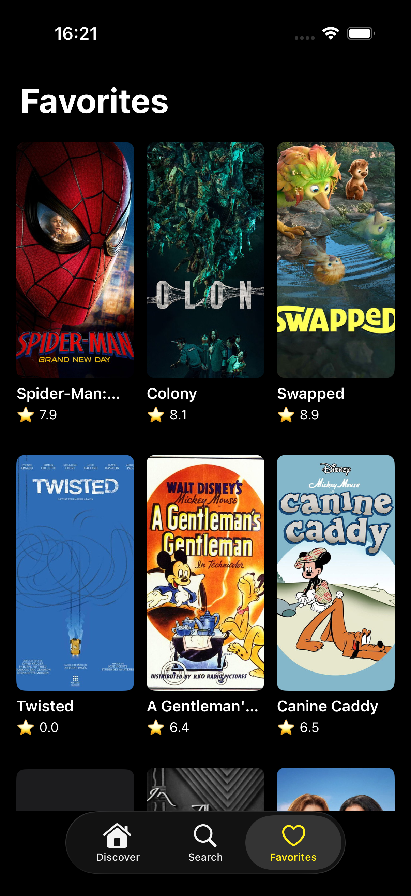
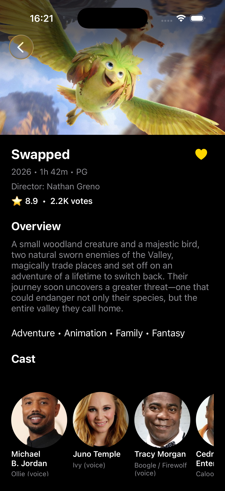
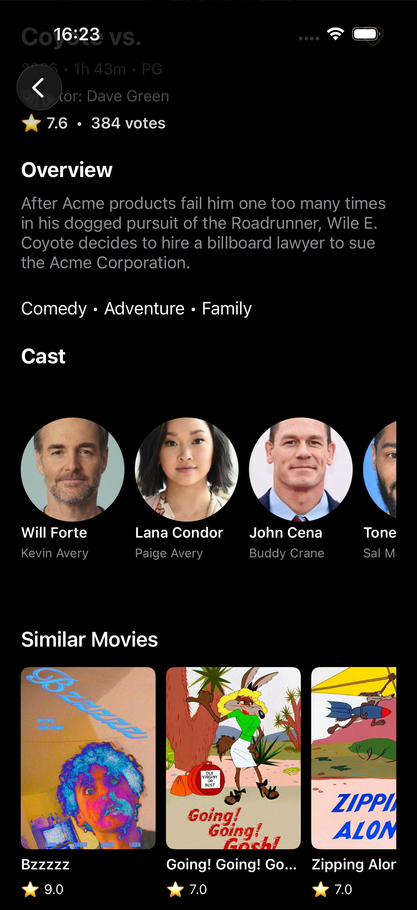
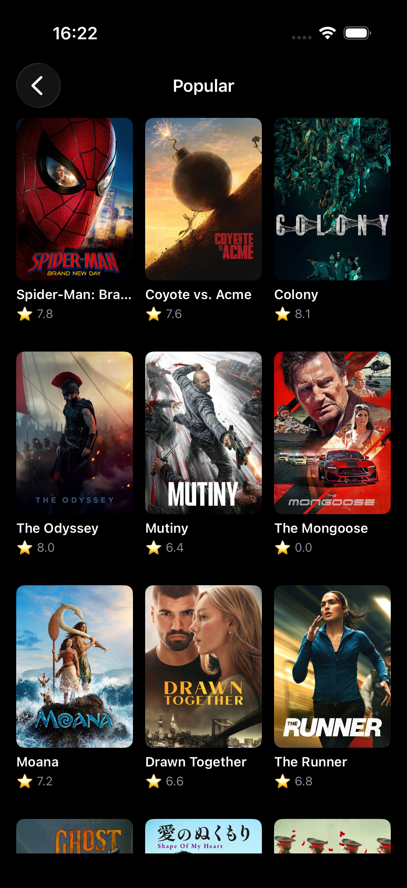

# 🎬 MovieBox

MovieBox is an iOS movie discovery app built with UIKit and the MVVM architecture.

The app uses the TMDB API to display current movie information and allows users to discover movies, search for titles, view detailed movie information, and save favorites.

## ✨ Features

- Discover popular, now playing, and top rated movies
- Browse complete movie lists with "See All"
- Search movies in real time
- View detailed movie information
- Display ratings, runtime, genres, certification, and director
- Browse cast members
- Discover similar movies
- Save and remove favorite movies
- Persistent favorites using Core Data
- Image loading and caching
- Loading, error, and empty states
- Dark cinematic user interface

## 🛠 Technologies

- Swift
- UIKit
- Storyboard
- MVVM
- async/await
- URLSession
- Codable
- Core Data
- NSCache
- Auto Layout
- TMDB API

## 📱 Screenshots

  
  
  

  
  
  

## 🏗 Architecture

MovieBox follows the MVVM (Model-View-ViewModel) architecture to separate UI, business logic, and data handling.

- **Models** represent movie and API data.
- **Views / ViewControllers** handle the user interface.
- **ViewModels** prepare and manage data for the views.
- **Services** handle networking and image loading.
- **Persistence** manages favorite movies using Core Data.

## 🌐 API

Movie data is provided by TMDB (The Movie Database).

The API access token is stored outside source control using an `.xcconfig` file.

## 📚 What I Practiced

While building MovieBox, I practiced:

- Building a multi-screen UIKit application
- Working with UITableView and UICollectionView
- Implementing MVVM
- Fetching data from a REST API
- Decoding JSON with Codable
- Using Swift Concurrency with async/await
- Loading and caching remote images
- Handling reusable cells and task cancellation
- Navigation and tab bar controllers
- Auto Layout and UIScrollView
- Persisting data with Core Data
- Handling loading, error, and empty states
- Building a consistent dark-mode interface

## 👨‍💻 Author

Ahmet Cilingir
